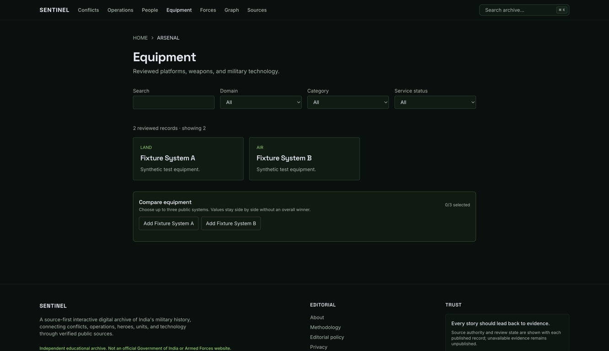

# Resumed visual audit — 9 September 2026

## Scope and verdict

One accepted desktop Equipment viewport, captured through the requested Computer Use tool and inspected from the exact saved file. The page is orderly and restrained, with readable section hierarchy and clear filter labels. It currently feels like a conventional archive rather than an intelligence workspace. The broader multi-page audit remains blocked by intermittent blank captures and Computer Use `noWindowsAvailable` errors. No mobile, measured contrast, zoom or screen-reader compliance is claimed.

## 1. Equipment directory — visually usable; theme and journey improvements needed

Evidence: `screenshots/2026-09-09/01-equipment.jpg` and matching accessibility text. Image is 1332×768, full-screen Chrome capture; CSS viewport dimensions and zoom were not separately measured. Fixture content is explicitly synthetic.

- **Strength:** search and three filters have clear labels; two equipment cards are easy to distinguish; comparison includes a visible selection count and explains its limit.
- **Consistency:** breadcrumb says ARSENAL while page/navigation say Equipment. Apply O18's shared Arsenal label with the Equipment and technology subtitle (P06).
- **Usefulness:** comparison sits below the results as a separate block. Add an explicit action on each system card and retain a compact selection tray as the directory grows (P07). The accepted viewport has two fixtures; it cannot prove behavior across pagination.
- **Information density:** cards expose domain and a generic summary but no variant, status date or evidence indicator. Use two genuinely sourced decision facts and an evidence link, following O09/P04. Do not fabricate facts to fill the card.
- **Spy identity:** the green palette supplies atmosphere, but the visible page lacks the dossier/assessment language and a recognizable investigation progression. Apply the central vocabulary and selected visual reference rather than adding scanner animations (P06).
- **Accessibility risk:** supporting copy and navigation are visually small at this capture size. Measure CSS font sizes, rendered contrast and target dimensions before asserting noncompliance; these pixels alone do not establish WCAG failure (V02).
- **Content boundary:** visible fixture labels are honest; the footer's broad verified-source language should not obscure that this environment is a demonstration. Use a clearly identified preview environment and real reviewed collection for product acceptance (P01/P09).

The first AX toggle showed pressed state before its label/count updated. A later fresh tree confirmed “1/3 selected”, “Remove Fixture System A” and a comparison link. Treat this as evidence that single-item selection eventually updated, not proof of full comparison or responsiveness; the capture/control channel was unreliable.

## Remaining numbered steps and health

2. **Homepage navigation — content reached, visual check blocked.** The old local server had stopped and Chrome reported connection refused. Port3001 was free; restarted the existing production build using explicit `.test-data/e2e.db`, without reseeding or rebuilding. Homepage accessibility tree then populated. Both full-screen and normal-window screenshots were blank and rejected.
3. **Search, comparison completion and downstream dossiers — not verified in resumed visual run.** Coordinate interaction returned `Computer Use server error -10005: noWindowsAvailable`; there is no accepted confirmation screenshot.
4. **Mobile, graph, sources, keyboard and assistive checks — pending.** Existing source review and planned tests remain applicable; no old screenshot was substituted.

## Tool and evidence disposition

Accepted screenshot inspected inline and saved unchanged. Two new rejected screenshots live under `screenshots/2026-09-09/rejected/`; SHA-256 and acceptance flags are in that date folder's manifest. The earlier 8 September rejected set remains historical evidence.

The [audit skill](/Users/apple/.codex/plugins/cache/openai-curated-remote/product-design/0.1.53/skills/audit/SKILL.md) requires rejecting blank captures and says “Do not claim an audit if the actual flow could not be accessed and captured.” Only step1 is a screenshot-backed surface audit; the complete flow is not certified. No alternative browser automation was substituted.

Local preview remains running at http://localhost:3001 using the existing synthetic database. The task-owned server was started through exec session35390. The original database and application source remain unchanged.
